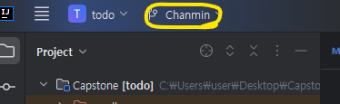
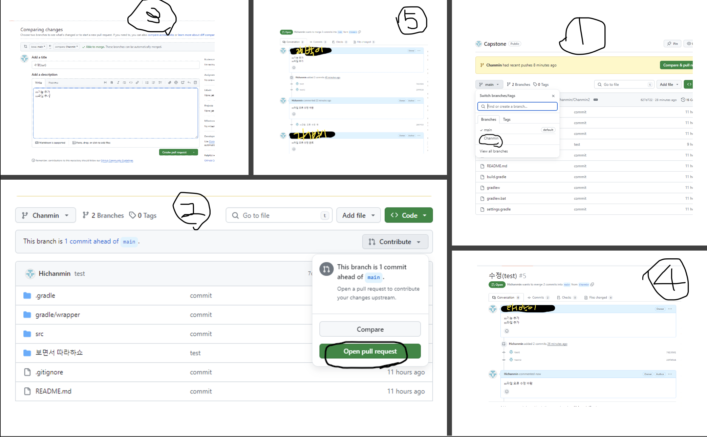

# ⚙️ ️작업 세팅!
### 1. 프로젝트 만들기
- 원하는 directory 안에 Capstone 폴더 생성
- IntellJ 켜서 열기 누르고 방금 만든 Capstone 폴더 선택

-----

### 2. 프로젝트 clone 하기
- IntellJ 왼쪽 하단 터미널창 열고 git Bash 열기


- 터미널 창에 아래 코드 입력 (Capstone_back 프로젝트 clone)
#### ```git clone https://github.com/Hichanmin/Capstone-back.git```
- 터미널 창에 아래 코드 입력 (Capstone_front 프로젝트 clone)
#### ```git clone https://github.com/tgyeom/Capston_front.git```
- 터미널 창에 아래 코드 입력(Git_Capstone 프로젝트 clone)
#### ```git clone https://github.com/Hichanmin/Git_Capstone```

-----

### 3. Capstone_back 프로젝트 세팅
- IntellJ 오른쪽 상단 파일 -> 열기 -> Capstone_back 폴더 선택 -> 이 창에서 열기
- 터미널 창에 아래 코드 입력 (현재 연결된 git repository 확인)
#### ```git remote -v```
- 터미널 창에 아래 코드 입력 (위에 실행했을 때 연결된 레포가 없을 때만)
#### ```git remote add origin https://github.com/Hichanmin/Capstone-back.git```

-----
# 🔧 작업 시작!
### 1. branch 만들고 checkout 하기
- 터미널 창에 아래 코드 입력
#### ```git branch 이름_dev```
#### ```git checkout Chanmin_dev```
- IntellJ 왼쪽 상단 보고 checkout 됐는지 확인


  

[잘못 만들었을 때 삭제하고 싶으면 다시 main branch 로 checkout 후에 아래 코드 입력]
#### ```git branch -d Chanmin_dev```
### 2. 코드 개발 시작

----

# 📋 작업 마무리!
### 1. 깃 add, commit, push 하기
- 터미널 창에 아래 코드 입력(add)
#### ```git add .```
- 터미널 창에 아래 코드 입력(commit)
#### ```git commit -m "xx기능 구현"```
- 터미널 창에 아래 코드 입력(push)
#### ```git push origin Chanmin_dev```

### 2. pull request


